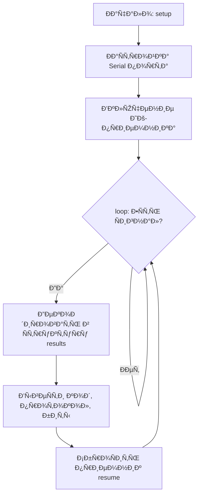

## 🔄 Ðлгоритм работы ИК-декодера

```mermaid
flowchart TD
    A[Ðачало: setup] --> B[ÐаÑтройка Serial порта]
    B --> C[Включение ИК-приемника]
    C --> D{loop: ЕÑÑ‚ÑŒ Ñигнал?}
    D -->|Ðет| D
    D -->|Да| E[Декодировать в Ñтруктуру results]
    E --> F[ВывеÑти код, протокол, биты]
    F --> G[СброÑить приемник resume]
    G --> D
```
