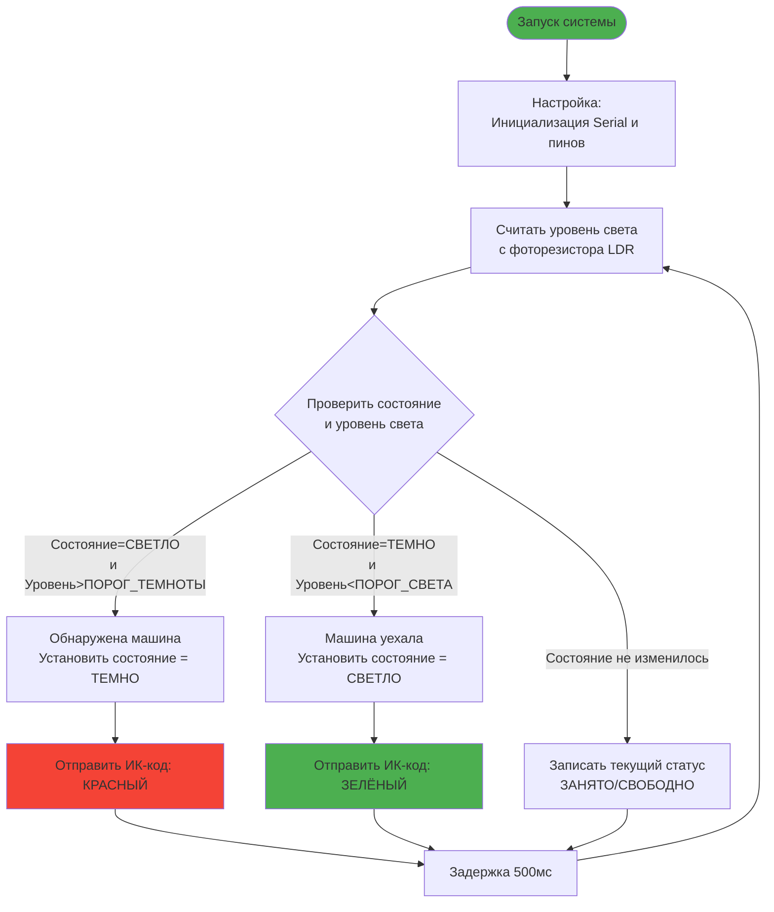

## 🔄 Алгоритм работы управляющей логики

```mermaid
flowchart TD
    Start([Запуск системы]) --> Setup[Настройка:<br>Инициализация Serial и пинов]
    Setup --> ReadLDR[Считать уровень света<br>с фоторезистора LDR]
    ReadLDR --> CheckState{Проверить состояние<br>и уровень света}
    
    CheckState -->|Состояние=СВЕТЛО<br>и Уровень>ПОРОГ_ТЕМНОТЫ| DarkDetected[Обнаружена машина<br>Установить состояние = ТЕМНО]
    DarkDetected --> SendRed[Отправить ИК-код: КРАСНЫЙ]
    SendRed --> WaitDelay[Задержка 500мс]
    
    CheckState -->|Состояние=ТЕМНО<br>и Уровень<ПОРОГ_СВЕТА| LightDetected[Машина уехала<br>Установить состояние = СВЕТЛО]
    LightDetected --> SendGreen[Отправить ИК-код: ЗЕЛЁНЫЙ]
    SendGreen --> WaitDelay
    
    CheckState -->|Состояние не изменилось| NoChange[Записать текущий статус<br>ЗАНЯТО/СВОБОДНО]
    NoChange --> WaitDelay
    
    WaitDelay --> ReadLDR
    
    style Start fill:#4CAF50
    style SendRed fill:#F44336
    style SendGreen fill:#4CAF50
```
